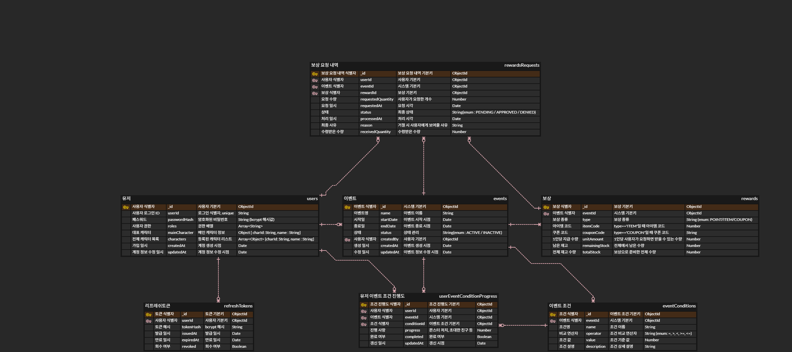

# 실행 방법

```bash
# 레포지토리 클론
git clone https://github.com/Tozinoo/nexon-task.git

# 프로젝트 폴더로 이동 / 컨테이너 빌드 & 실행
cd nexon-task 
docker-compose down && docker-compose up --build
```

## API 명세서
### 테스트 계정 정보

2025-05-25: 테스트 계정 정보만 추가 (코드 수정 없음)

`/auth` 서버는 초기 실행 시 아래와 같이 4개 역할의 계정이 자동으로 생성됩니다.

| username | password     | role     |
| -------- | ------------ | -------- |
| user     | Password123! | USER     |
| operator | Password123! | OPERATOR |
| auditor  | Password123! | AUDITOR  |
| admin    | Password123! | ADMIN    |

* 최초 컨테이너 빌드 시 기존 유저가 모두 삭제되고 위 계정들이 다시 생성됩니다.
### **Auth 서버**

#### 1. 회원가입

* POST `/auth/register`
* 설명: 회원가입 (username, password)
* Request Body 예시

  ```json
  {
    "username": "testuser",
    "password": "securepassword"
  }
  ```
* 권한: 모두

---

#### 2. 로그인

* POST `/auth/login`
* 설명: 로그인 후 JWT 발급
* Request Body 예시

  ```json
  {
    "username": "testuser",
    "password": "securepassword"
  }
  ```
* 권한: 모두

---

#### 3. 유저 권한 변경 (ADMIN)

* PATCH `/auth/role/:userId`
* 설명: 대상 유저의 역할 변경 (ADMIN만 가능)
* 헤더: Authorization: Bearer {token}
* Request Body 예시

  ```json
  {
    "role": "OPERATOR"
  }
  ```
* 권한: ADMIN

---

#### 4. 내 정보 조회

* GET `/auth/me`
* 설명: 본인 정보(JWT 기반)
* 헤더: Authorization: Bearer {token}
* 권한: USER


---

### Event 서버

#### 1. 이벤트 및 조건 등록

* POST `/event`
* 설명: 이벤트 생성, 조건 배열 포함
* 헤더: Authorization: Bearer {token}
* Request Body 예시

  ```json
  {
    "name": "친구 추가 이벤트",
    "startDate": "2025-06-05T00:00:00.000Z",
    "endDate": "2025-06-20T23:59:59.999Z",
    "status": "ACTIVE",
    "conditions": [
      {
        "name": "친구 추가 수",
        "operator": ">=",
        "value": 3,
        "description": "친구를 3명 추가하면 완료"
      }
    ]
  }
  ```
* 권한: ADMIN, OPERATOR

---

#### 2. 전체 이벤트 목록 조회

* GET `/event`
* 설명: 모든 이벤트 조회
* 헤더: 없어도 됨
* 권한: 모두

---

#### 3. 이벤트 상세 조회

* GET `/event/:eventId`
* 설명: 특정 이벤트 상세 정보(+조건)
* Path Param: eventId (예: 682b7a8e9938a824839c88b3)
* 권한: 모두

---

#### 4. 보상 등록

* POST `/event/:eventId/reward`
* 설명: 해당 이벤트에 보상 등록
* 헤더: Authorization: Bearer {token}
* Request Body 예시

  ```json
  {
    "type": "ITEM",
    "itemCode": 20001234,
    "unitAmount": 1,
    "totalStock": 100,
    "remainingStock": 100
  }
  ```
* 권한: ADMIN, OPERATOR

---

#### 5. 보상 조회

* GET `/event/:eventId/reward`
* 설명: 이벤트별 보상 전체 조회
* Path Param: eventId
* 권한: 모두

---

#### 6. 보상 요청

* POST `/reward/\:rewardId/request`
* 설명: 해당 보상에 대한 요청(유저가 조건 달성 시)
* Path Param
  * `rewardId` : 보상 ObjectId (예: 682b850e2bda3d87f23f4d20)
* 헤더
  * `Authorization: Bearer {access_token}` (USER 권한)
* Request Body 예시
  ```json
  {
    "eventId": "682b7a8e9938a824839c88b3",
    "requestedQuantity": 1
  }
  ```
* Response 예시

  ```json
  {
    "_id": "xxxx",
    "userId": "....",
    "eventId": "682b7a8e9938a824839c88b3",
    "rewardId": "682b850e2bda3d87f23f4d20",
    "requestedQuantity": 1,
    "requestedAt": "2025-06-01T12:00:00.000Z",
    "status": "PENDING"
  }
  ```
* 권한: USER

---

#### 7. 내 보상 요청 내역

* GET `/reward-requests`

* 설명: 로그인 유저의 보상 요청 내역만 조회
* 헤더

  * `Authorization: Bearer {access_token}` (USER 권한)
* Response 예시

  ```json
  [
    {
      "_id": "xxxx",
      "userId": "...",
      "eventId": "682b7a8e9938a824839c88b3",
      "rewardId": "682b850e2bda3d87f23f4d20",
      "requestedQuantity": 1,
      "requestedAt": "2025-06-01T12:00:00.000Z",
      "status": "APPROVED"
    },
    ...
  ]
  ```
* 권한: USER

---

#### 8. 전체 보상 요청 내역 (관리자/감사자)

* GET `/reward-requests/all`

* 설명: 전체 유저의 보상 요청 내역 모두 조회
* 헤더

  * `Authorization: Bearer {access_token}` (OPERATOR, ADMIN, AUDITOR)
* Response 예시

  ```json
  [
    {
      "_id": "xxxx",
      "userId": "...",
      "eventId": "682b7a8e9938a824839c88b3",
      "rewardId": "682b850e2bda3d87f23f4d20",
      "requestedQuantity": 1,
      "requestedAt": "2025-06-01T12:00:00.000Z",
      "status": "PENDING"
    },
    ...
  ]
  ```
* 권한: OPERATOR, ADMIN, AUDITOR    
&nbsp;

&nbsp;

# 개발 시나리오

### 요구사항

1. 유저 권한 정리

| Role | 권한 |
| --- | --- |
| USER | 본인 이벤트 진행도, 보상 요청 내역 조회만 가능. |
| OPERATOR | 이벤트/보상 등록, 보상 요청 내역 조회 가능 |
| AUDITOR | 보상 이력 조회만 가능 |
| ADMIN | 전체 기능 가능 |

### 주요 기능

1. Auth Server
- 회원가입, 로그인 (JWT 발급)
- Role 변경 가능 (ADMIN만 변경 가능하게)

2. Event Server
- 이벤트 등록(이름/기간/상태/조건)
- 이벤트 조건 등록(먼저 이벤트마다 1개의 조건. ~~추후 여러개 조건 추가~~)
- 이벤트 목록/상세 조회
- 보상 등록(포인트, 아이템, 쿠폰 등)
    - 하나의 이벤트에 여러 보상 연결 가능
- 보상 목록/상세 조회 (이벤트별)
- 유저는 이벤트의 조건을 달성했을 때 보상을 요청할 수 있다.
    - 조건 미달/중복요청 불가
    - 요청 성공/실패 기록
- 요청 조건 충족 여부 후 자동 승인/거절
- 보상 요청 내역 조회
    - USER: 본인 요청 내역만
    - OPERATOR/ADMIN/AUDITOR: 전체 요청 내역 가능 (필터: 유저, 이벤트, 상태별 조회 지원)
    
3. Gateway Server
- 모든 요청의 진입점 (JWT 검증/권한 체크)
- 역할별로 Auth ,Event 서버로 라우팅
- 각 서비스로 userId/role 등 신뢰정보 헤더로 전달

4. 검증 사항
- 이벤트 조건을 달성하지 않은 유저는 보상 요청 불가
- 같은 이벤트-보상에 대해 중복 요청 불가
- 재고 소진, 기간 만료 등 예외처리 필요
- 권한 없는 사용자/역할이 접근 시 403 Forbidden 반환

### ERD 설계



### API 설계 (엔드포인트, 권한)

- 모든 요청은 Gateway Server로 진입
- JWT 검사, 역할 체크 → Event/Auth 서버에 프록시(Proxy) 요청
- Role 권한도 Gateway Server가 처리

### 1. Auth Server

| 메소드 | URL | 설명 | 권한 |
| --- | --- | --- | --- |
| POST | /auth/register | 회원가입 | 모두 |
| POST | /auth/login | 로그인(JWT 발급) | 모두 |
| PATCH | /auth/role | 역할 변경 | ADMIN |
| GET | /auth/me | 내 정보 조회 | USER |
### 2. Event Server

| 메소드 | URL | 설명 | 권한 |
| --- | --- | --- | --- |
| POST | /event | 이벤트 및 조건 등록 | ADMIN, OPERATOR |
| GET | /event | 전체 이벤트 목록 조회 | 모두 |
| GET | /event/:eventId | 이벤트 상세 조회 | 모두 |
| POST | /event/:eventId/reward | 보상 등록 | ADMIN, OPERATOR |
| GET | /event/:eventId/reward | 보상 조회 | 모두 |
| POST | /reward/:rewardId/request | 보상 요청 | USER |
| GET | /reward-requests | 내 보상 요청 내역 | USER |
| GET | /reward-requests/all | 전체 보상 요청 내역 | OPERATOR, ADMIN, AUDITOR |

### 겪은 고민 사항

1. Gateway에서 JWT 토큰 검사, Role 검사를 하였지만 Auth나 Event Server에서도 이중으로 해주면 좋지 않을까? 라고 생각했습니다.
하지만 MSA에서는 Gateway 서버를 믿고 내부 서비스에서는 그 정보를 신뢰하고 추가 체크나 커스텀 헤더 없이 비즈니스 로직만 집중하는 형태로 진행하는 것으로 봐서 Auth와 Event 서버는 검증은 다 뺐습니다.
2. 직접 auth, event 서버를 단독 테스트할 때 x-user-id 등 헤더를 빼먹고 호출해서 undefined 에러, ObjectId 변환 에러 등도 많이 겪었습니다.
이 때문에 내부 서비스 테스트에도 커스텀 헤더 자동화 코드를 추가하는 것이 필요하다고 느꼈습니다.
3. 보상 요청 쪽 테스트를 진행 못하였습니다. 제출 후에 좀 더 보완할 수 있으면 진행하고 새 branch에 올려보도록 하겠습니다.
